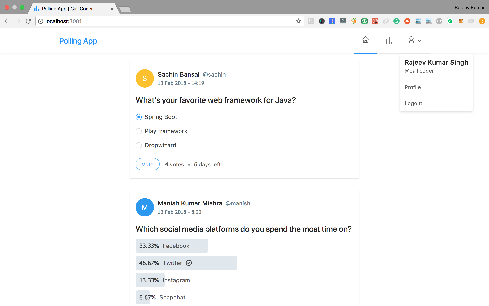

## Polling App: React + Java Spring Boot (Maven) + MySQL

This example shows how to leverage `knts` to develop a React + Java Spring Boot (Maven) + MySQL Sample App directly on any Cloud. The Sample App is deployed using a `helm`. It creates the following components:

- A *React* based **frontend**.
- A Java Spring Boot **api**.
- A [MySQL](https://www.mysql.com/) database.

## Preview



## Tutorial
- Initialise the knts cli for the 1st use by the following command
```
knts init
```
- Up the Dev envinorment using the following command
```
knts up
```
- Once the useage of the perticular service is done, then down the dev container by the following command
```
ctrl + c
ctrl + d
knts down
```
- Once the usage of the dev environment is done, Destroy the environment using the following command
```
knts destroy
```